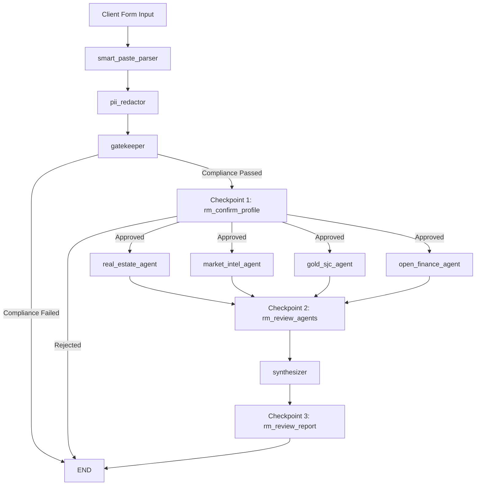

# Viet-Advisory Orchestrator

AI Co-Pilot for Relationship Managers (RMs), built by CLOUD WEAVERS for Swin Hackathon 2026.

This project orchestrates a multi-agent advisory workflow with human-in-the-loop checkpoints for compliance-sensitive financial recommendations.

## Table of Contents

- [Overview](#overview)
- [Key Features](#key-features)
- [Tech Stack](#tech-stack)
- [Architecture](#architecture)
- [Project Structure](#project-structure)
- [Installation and Local Setup](#installation-and-local-setup)
- [API Endpoints](#api-endpoints)
- [Usage Flow](#usage-flow)
- [Troubleshooting](#troubleshooting)

## Overview

Viet-Advisory Orchestrator combines:

- A FastAPI + LangGraph backend that coordinates domain-specific advisory agents.
- A React + TypeScript frontend that guides RM decisions at each checkpoint.
- Built-in PII redaction and compliance gating before recommendation synthesis.

The system is designed to reduce manual effort while keeping RM oversight in critical steps.

## Key Features

- Structured client intake form with bilingual flow (VI/EN).
- Compliance gatekeeper checks before advisory processing continues.
- Human approval checkpoints at three stages:
	- Client profile confirmation
	- Agent output review
	- Final report approval
- Parallel advisory domain agents:
	- Real estate intelligence
	- Market intelligence
	- Gold pricing and holdings
	- Open finance signals
- Final synthesized advisory report in markdown format.
- Session-based orchestration using LangGraph checkpoints.

## Tech Stack

### Frontend

- React 19
- TypeScript
- Vite
- Tailwind CSS 4
- shadcn/ui components
- react-markdown + remark-gfm

### Backend

- Python 3.11+
- FastAPI
- LangGraph / LangChain Core
- Google GenAI SDK (Gemini)
- Uvicorn
- Pydantic

### Data and Integrations

- Local JSON datasets in `backend/data/`
- Gemini model via `GEMINI_API_KEY`

## Architecture

The orchestrator executes a directed workflow with interruptible checkpoints for RM decisions.



## Project Structure

```text
CLOUD-WEAVERS-Hackathon/
|- backend/
|  |- agents/               # Domain and orchestration nodes
|  |- data/                 # Mock and reference datasets
|  |- models/               # Typed workflow state
|  |- utils/                # LLM + privacy helpers
|  |- graph.py              # LangGraph definition
|  |- server.py             # FastAPI server and endpoints
|  \- pyproject.toml
|- frontend/
|  |- src/components/       # UI steps and checkpoint screens
|  |- src/api.ts            # Backend API client
|  |- src/App.tsx           # Main orchestration UI
|  \- package.json
\- README.md
```

## Installation and Local Setup

### 1. Prerequisites

- Python 3.11 or newer
- uv
- Node.js 20 or newer
- npm
- A Gemini API key

### 2. Backend Setup

From the repository root:

```bash
cd backend
uv sync
```

Edit `.env` and set:

```env
GEMINI_API_KEY=your_api_key_here
```

Run backend server:

```bash
uv run uvicorn server:app --reload --host 0.0.0.0 --port 8000
```

### 3. Frontend Setup

Open a new terminal from repository root:

```bash
cd frontend
npm install
npm run dev
```

Frontend default URL: `http://localhost:5173`

Backend default URL: `http://localhost:8000`

The frontend is configured to call backend API at:

- `http://localhost:8000/api/advisory`

## API Endpoints

Base path: `/api/advisory`

- `GET /scenarios`
	- Returns sample scenarios used by the UI.
- `POST /start-form`
	- Starts a new advisory session from structured form data.
	- Returns `session_id`, current `state`, and interrupt status.
- `POST /approve`
	- Submits RM decision for current checkpoint.
	- Request body: `session_id`, `approved`, `reason`.
- `GET /state/{session_id}`
	- Returns current workflow state and completion status.

## Usage Flow

1. RM submits client form.
2. System parses, redacts PII, and runs compliance checks.
3. RM approves profile checkpoint (or stops the flow).
4. Domain agents generate insights.
5. RM reviews agent outputs.
6. Synthesizer builds final advisory report.
7. RM approves final report or requests revisions.

## Troubleshooting

- CORS error in browser:
	- Ensure frontend runs on `http://localhost:5173` and backend on `http://localhost:8000`.
- Empty or missing model output:
	- Verify `GEMINI_API_KEY` is set correctly in `backend/.env`.
- Backend import/dependency errors:
	- Run `uv sync` again in `backend/`.
- Frontend cannot reach API:
	- Ensure backend server is running and reachable at port 8000.

## Notes

This repository was developed as a hackathon prototype and can be extended with production-grade authentication, persistence, observability, and policy controls.
